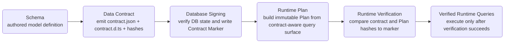

Prisma Next works as a Verification-First Workflow:

**Schema -> Data Contract -> Database Signing -> Verified Runtime Queries**

## Lifecycle diagram



## Step 1: Schema

You define the data model in Schema authoring sources.

This is the intent stage: what data exists, how it relates, and what capabilities are required.

```prisma title="schema.prisma"
model User {
  id    Int    @id @default(autoincrement())
  email String @unique
}
```

## Step 2: Data Contract

Schema intent is emitted into Contract Artifacts:

- `contract.json` (machine-readable contract data)
- `contract.d.ts` (typed contract surface)

The Data Contract carries hash identities such as `storageHash` and `profileHash`, which are used for compatibility checks.

```ts title="load-contract.ts"
import type { Contract } from './contract.d';
import contractJson from './contract.json' with { type: 'json' };
import { validateContract } from '@prisma-next/sql-contract/validate';

const contract = validateContract<Contract>(contractJson);
const { storageHash, profileHash } = contract;
```

## Step 3: Database Signing

The database is verified against the Data Contract and then signed by writing the Contract Marker.

The Contract Marker stores the signed contract identity (for example `storageHash` and `profileHash`) so later stages can prove compatibility quickly and deterministically.

```sql title="contract-marker.sql"
-- Conceptual marker record after successful signing
storage_hash = 'sha256:2e7d...'
profile_hash = 'sha256:9af1...'
```

## Step 4: Verified Runtime Queries

Application queries are built as immutable Plans from the contract-aware query surface.

Before execution, runtime verifies that plan and contract identity match the Contract Marker.

- If hashes match, query execution proceeds.
- If hashes do not match, runtime blocks execution and reports a contract mismatch.

This is what makes runtime queries verified, not assumed.

```ts title="build-and-execute-plan.ts"
import { schema } from '@prisma-next/sql-relational-core/schema';
import { sql } from '@prisma-next/sql-lane/sql';

const tables = schema(contract).tables;

const plan = sql({ contract, adapter })
  .from(tables.user)
  .select({
    id: tables.user.columns.id,
    email: tables.user.columns.email,
  })
  .build();

for await (const row of runtime.execute(plan)) {
  // executes only after Contract Marker verification passes
  console.log(row.id, row.email);
}
```

## Verification-first feedback loop

Prisma Next keeps verification in the loop continuously:

1. Verify before signing database state.
2. Verify again before runtime query execution.
3. Fail early on mismatch instead of allowing drift to propagate.

As Schema evolves, the lifecycle repeats with a new Data Contract and a new signature state.
