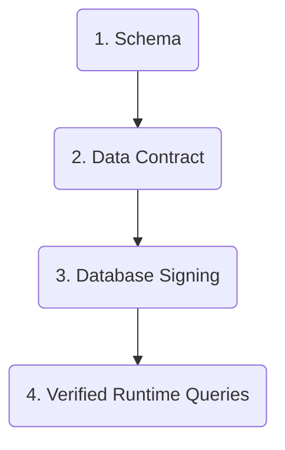

Prisma Next is a new foundation for the Prisma ORM.

It keeps what developers already like about Prisma, including the declarative schema and a DX-first query experience, while rebuilding the architecture to be more extensible and composable in TypeScript end to end.

Prisma Next is being built in the open as direction and architecture. Prisma 7 remains the stable production path today.

## What is Prisma Next

Prisma Next brings multiple capabilities into one framework:

- A model-first ORM query experience that stays readable as your app grows
- A type-safe SQL query builder for custom query control
- Middleware for guardrails such as lints and budgets
- Database support and extensions as packages
- Contract-driven verification across schema, database state, and runtime execution

## Why Prisma Next

Prisma Next exists to solve practical constraints in current architecture.

As applications scale, teams need to move quickly while keeping behavior consistent across databases and environments. Prisma Next is designed to make behavior more explicit and easier to extend.

It focuses on:

- **Extensibility by default** so capabilities can evolve through packages
- **Composable architecture** so query builders, middleware, and extensions can be combined cleanly
- **Better feedback loops** for humans and assistants through explicit artifacts and verification checks
- **Predictable runtime behavior** through pre-execution verification and clear mismatch signaling

## Developer impact

Prisma Next is designed to keep developer ergonomics while improving control.

You can use a model-first ORM style query flow:

```ts
const users = await db.users
  .emailDomain("prisma.io")
  .select("id", "email", "createdAt")
  .take(25)
  .all();
```

And you can drop to a SQL builder when needed:

```ts
const post = db.schema.tables.post;

const plan = db.sql
  .from(post)
  .select({ id: post.columns.id, title: post.columns.title })
  .orderBy(post.columns.createdAt.desc())
  .limit(20)
  .build();
```

Middleware can apply rules around every query:

```ts
const db = createDb({
  middleware: [queryLints(), queryBudgets()],
});
```

## Syntax comparison

```ts tab="Prisma Next"
const users = await db.users
  .emailDomain("prisma.io")
  .select("id", "email", "kind", "createdAt")
  .include("posts", (post) =>
    post
      .withTitle("prisma")
      .orderBy((p) => p.createdAt.desc())
      .take(3)
      .select("id", "title", "createdAt"),
  )
  .orderBy([(user) => user.kind.asc(), (user) => user.createdAt.desc()])
  .take(25)
  .all()
```

```ts tab="Prisma ORM v7"
const users = await prisma.user.findMany({
  where: { email: { endsWith: "prisma.io" } },
  select: {
    id: true,
    email: true,
    kind: true,
    createdAt: true,
    posts: {
      where: { title: { contains: "prisma" } },
      orderBy: { createdAt: "desc" },
      take: 3,
      select: { id: true, title: true, createdAt: true },
    },
  },
  orderBy: [{ kind: "asc" }, { createdAt: "desc" }],
  take: 25,
});
```

## Contract-driven architecture

Contract-driven means your application and your database share one explicit agreement.

- You define intent in a **Schema**
- Prisma Next records that intent as a **Data Contract**
- Prisma Next emits **Contract Artifacts** such as `contract.json` and `contract.d.ts`
- Runtime checks behavior against that contract before execution

A useful mental model is that the Data Contract acts like a lock file for your database expectations.

## Verification-first workflows

A **Verification-First Workflow** runs checks before risky actions.

In Prisma Next, verification happens before:

- signed database state is accepted
- runtime queries execute

That helps catch drift and incompatibility earlier, before incorrect behavior reaches production.

## How Prisma Next works

Prisma Next follows one lifecycle:



### 1. Schema

You define your data model and relationships in the **Schema**.

This is the source of application intent.

### 2. Data Contract

Prisma Next records schema intent as a **Data Contract** and emits **Contract Artifacts**.

These artifacts are machine-readable and become the shared definition of what the application expects from the database.

### 3. Database Signing

Prisma Next verifies database state against the Data Contract and records contract identity as a **Contract Marker**.

This gives each environment an explicit signed compatibility state.

### 4. Verified Runtime Queries

At runtime, Prisma Next builds a **Plan**, verifies plan and contract identity against the Contract Marker, and executes only when verification passes.

If verification fails, execution is blocked and mismatch information is surfaced clearly.

## Key terms

- **Schema**: Human-authored model definition
- **Data Contract**: Machine-readable representation of application data expectations
- **Contract Artifacts**: Generated contract files such as `contract.json` and `contract.d.ts`
- **Database Signing**: Recording contract identity in database state
- **Contract Marker**: Signed contract identity stored in the database
- **Plan**: Explicit query plan built before execution
- **Verified Runtime Queries**: Queries that run only after verification checks pass
- **Verification-First Workflow**: Verification before mutation and execution

## Continuity

Prisma 7 remains the stable production path today.

Prisma Next is the architecture direction being built in the open. It represents the next foundation for Prisma ORM, with a future upgrade path when this foundation is ready for broad use.

## Summary

Prisma Next is a new foundation for the Prisma ORM that combines contract-driven architecture with verification-first workflows. You define intent in a Schema, Prisma Next records that as a Data Contract, the database is signed to that contract, and runtime queries execute only after verification checks pass. This gives teams clearer extension paths, stronger guardrails, and more predictable behavior across environments.
